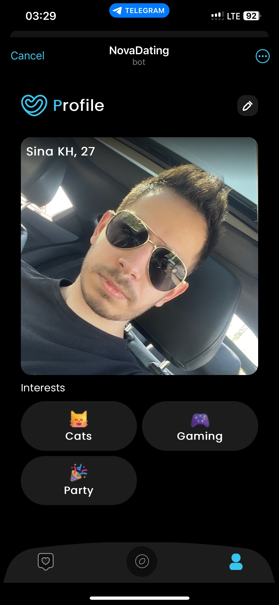

# 🍾 [NovaDating TelegramWebApp](http://t.me/NovaDatingBot/app)

This is the merged repository for [**front-end**](https://github.com/Sina-KH/Nova-Dating-TWA) / [**back-end**](https://github.com/Sina-KH/Nova-Dating-Service) source codes of the [@NovaDatingBot](https://t.me/TeleDatingBot) telegram web app. (**containing latest commit before the dead-line of the contest.**)

This bot is written as a mini-app for [Telegram Mini-App Contest](https://t.me/contest/327).
It is developed and submitted as a dating mini-app for this contest and lets its users find their ideal friends/partner~~s~~ with mutual interests.

Feel free to use this source code as your new project's template. I tried to develop it as easy to understand and clear, as I could. It is NOT over-engineered at all!

## 🤓 Features / User Flow

- [x] 🤘 No classic registrations required, users will be registered using their Telegram account.
- [x] 🥸 Choose your `Gender`, `Age`, `Interests` and upload your `profile photos` to let other users know you.
- [x] 🔥 Find friends based on your interests and filters. Like them and get their telegram account once you've matched!
- [x] 📱 Telegram color-palette support. The app will use the active theme of the telegram.
- [x] 📝  Multi-language support.
- [x] ⚡️ Socket.IO connection to easily add real-time features. **`New Match` event is now implemented.**
- [x] 🐇 Clustered back-end forks.
- [x] 🤖 Auto postman collection generator/uploader.
- [ ] ☝️ **We should Disable collapse gesture** in `explore` and `crop` screens. (Seems like it's not supported in telegram web apps yet?)
- [ ] 📍 For now, It shows all registered users, but I will add location filters in the future revisions.

## Back-end source code

### [You can check back-end source code and its README file here](Nova-Dating-Service/README.md).

## Front-end source code (client-side)

### [You can check front-end source code and its README file here](Nova-Dating-TWA/README.md).